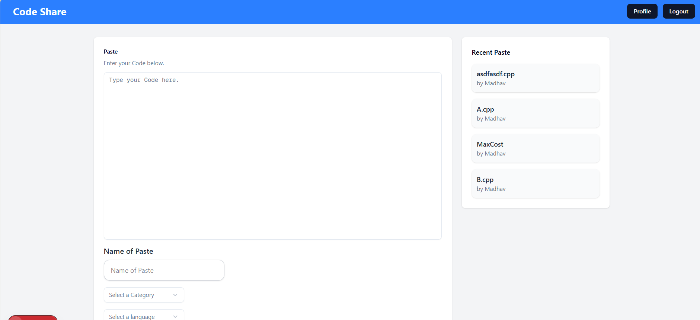

# 🧾 CodeShare --- Pastebin Clone

A modern code-sharing web application built with **Next.js**, **React**,
and **MongoDB** that lets users quickly create, share, and manage code
snippets.

------------------------------------------------------------------------

## 🚀 Features

-   🔐 Authentication with Kinde SDK\
-   📝 Create and share code snippets instantly\
-   🌐 Unique shareable links for each paste\
-   🧑‍💻 Syntax-friendly code display\
-   📂 Persistent storage using MongoDB\
-   ⚡ Fast and responsive UI\
-   🛡️ Fully type-safe with TypeScript

------------------------------------------------------------------------

## 🛠️ Tech Stack

  Layer      Technology
  ---------- ------------------------------
  Frontend   Next.js, React, Tailwind CSS
  Backend    Next.js API Routes
  Database   MongoDB
  Auth       Kinde SDK
  Language   TypeScript

------------------------------------------------------------------------

## 📁 Project Structure

    .
    ├── app/            
    ├── components/     
    ├── lib/            
    ├── models/         
    ├── pages/api/      
    ├── public/         
    └── types/          

------------------------------------------------------------------------

## ⚙️ Installation & Setup

### 1. Clone the repository

    git clone https://github.com/your-username/codeshare.git
    cd codeshare

### 2. Install dependencies

    npm install

### 3. Configure environment variables

Create a `.env.local` file:

    MONGODB_URI=your_mongodb_connection_string

    KINDE_CLIENT_ID=your_kinde_client_id
    KINDE_CLIENT_SECRET=your_kinde_client_secret
    KINDE_ISSUER_URL=your_kinde_issuer_url
    KINDE_REDIRECT_URL=http://localhost:3000/api/auth/callback
    KINDE_LOGOUT_REDIRECT_URL=http://localhost:3000

### 4. Run the development server

    npm run dev

### 5. Open in browser

http://localhost:3000

------------------------------------------------------------------------

## 🧩 API Overview

  Method   Endpoint         Description
  -------- ---------------- --------------
  POST     /api/paste       Create paste
  GET      /api/paste/:id   Get paste
  DELETE   /api/paste/:id   Delete paste

------------------------------------------------------------------------

## 🖼️ Screenshots

### 🏠 Home Page

------------------------------------------------------------------------

## 🚀 Future Improvements

-   Search functionality\
-   Dark mode\
-   Copy-to-clipboard\
-   Tags & categories\
-   Analytics

------------------------------------------------------------------------

## 📄 License

MIT License
